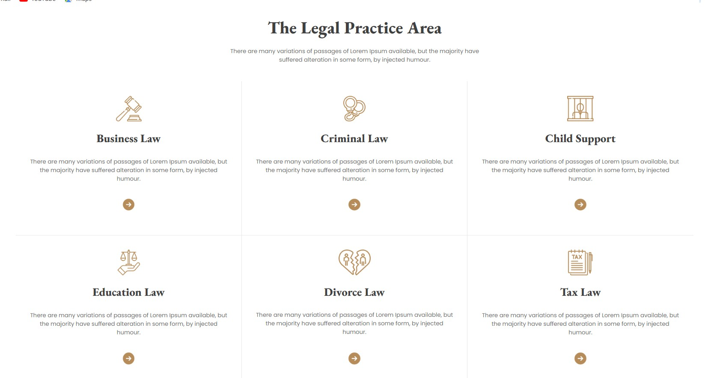

# Justice

Justice is a responsive web page built using HTML, CSS, Tailwind CSS, and Daisy UI. This project showcases modern web design practices with a clean and intuitive user interface.

## Features

- **Responsive Design:** Adapts to any device, ensuring a seamless user experience on desktops, tablets, and mobile devices.
- **Modern Styling:** Utilizes Tailwind CSS and Daisy UI for a fresh and contemporary look.
- **Ease of Use:** Simple and intuitive navigation.
- **Image Gallery:** Displays six pictures in a 2-row, 3-column layout at the bottom of the page.

## Technologies Used

- HTML
- CSS
- Tailwind CSS
- Daisy UI

## Installation

1. Clone the repository:
   ```bash
   git clone https://github.com/Erfan-Khan-Dhrubo/project-3.1-Web-development.git
   ```

## Images

Below are some screenshots of the Justice webpage:

  
  
  
  
  
  
  
  
  

The images demonstrate the clean and modern UI, as well as the responsive design, achieved using Tailwind CSS and DaisyUI.
